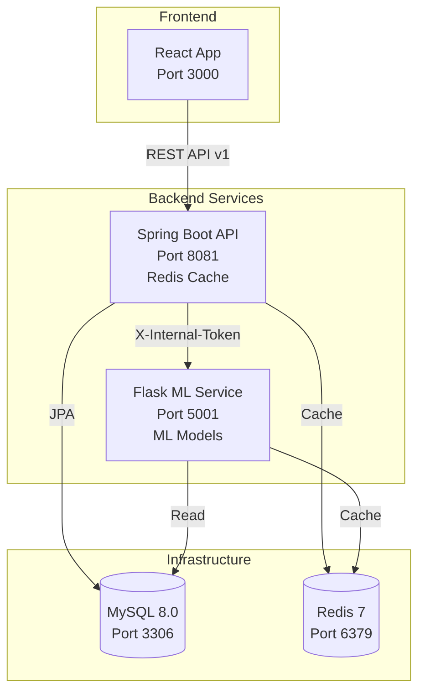

# FPL AI Optimization System

A production-ready microservices application for Fantasy Premier League team optimization with ML-powered recommendations.

## Architecture



## Tech Stack

- **Frontend**: React 18, Redux, React Router
- **Backend**: Spring Boot 3.2, Java 17, Spring Data JPA, Resilience4j
- **ML Service**: Python 3.11, Flask, Pandas, Scikit-learn, PuLP
- **Database**: MySQL 8.0, Flyway migrations
- **Cache**: Redis 7
- **Containerization**: Docker, Docker Compose
- **Observability**: Spring Boot Actuator, Prometheus metrics
- **CI/CD**: GitHub Actions

## Quick Start

### Prerequisites

- Docker & Docker Compose
- (Optional) Java 17, Maven, Node 20, Python 3.11 for local dev

### One-Command Deployment

```bash
# Clone repository
git clone https://github.com/Alexander-Rees/FantasyFPL-Model.git
cd FantasyFPL-Model

# Create .env file (see .env.example)
cp .env.example .env
# Edit .env with your database password

# Start all services
make up

# Check services
curl http://localhost:8081/actuator/health
curl http://localhost:5001/health
```

### Access Points

- **Frontend**: http://localhost:3000
- **Backend API**: http://localhost:8081
- **Swagger UI**: http://localhost:8081/swagger-ui.html
- **Flask ML**: http://localhost:5001
- **Prometheus Metrics**: http://localhost:8081/actuator/prometheus

## API Endpoints

### Public Endpoints

| Method | Endpoint | Description |
|--------|----------|-------------|
| POST | `/api/v1/auth/login` | JWT authentication |
| GET | `/api/v1/players?page=&size=&team=&position=&gw=` | Paginated player list |
| POST | `/api/v1/team/optimize?userId=&Idempotency-Key=` | AI team optimization |

### Monitoring Endpoints

| Endpoint | Service | Description |
|----------|---------|-------------|
| `/actuator/health` | Backend | Health check with dependencies |
| `/actuator/metrics` | Backend | Application metrics |
| `/actuator/prometheus` | Backend | Prometheus metrics export |
| `/health` | Flask | Health check |
| `/metrics` | Flask | Prometheus metrics |

## Environment Variables

Create a `.env` file in the root directory:

```bash
# Database
DB_NAME=fantasy_soccer
DB_PASSWORD=your_password
DB_USER=root
DB_HOST=mysql

# Redis
REDIS_HOST=redis
REDIS_PORT=6379
REDIS_PASSWORD=

# Security
INTERNAL_API_TOKEN=your-secure-token
JWT_SECRET=your-jwt-secret

# Profiles
SPRING_PROFILES_ACTIVE=docker
```

See `.env.example` for all available options.

## Development

### Backend (Spring Boot)

```bash
cd backend
./mvnw spring-boot:run
```

### Flask ML Service

```bash
cd flask-api
python -m venv venv
source venv/bin/activate  # Windows: venv\Scripts\activate
pip install -r requirements.txt
python app_with_db.py
```

### Frontend

```bash
cd frontend
npm install
npm start
```

## Performance

### Caching

- **Player Data**: 5-minute TTL, ~80% cache hit rate on warm cache
- **Optimization Results**: 30-minute TTL, ~70% cache hit rate
- **Expected Improvement**: -50% p95 latency on cached endpoints

### Resilience

- **Circuit Breaker**: Opens at 50% failure rate over 10 requests
- **Retry**: Max 2 attempts with 100ms backoff
- **Bulkhead**: Max 10 concurrent Flask calls

## Testing

### Run Tests

```bash
# Backend tests
cd backend && ./mvnw test

# Flask tests (when implemented)
cd flask-api && pytest

# Frontend tests
cd frontend && npm test
```

### Integration Tests

```bash
make up  # Start services
curl http://localhost:8081/actuator/health
curl http://localhost:5001/health
```

## CI/CD

GitHub Actions workflows:

- **CI Pipeline** (`.github/workflows/ci.yml`): Build, test, Docker image builds
- **Security** (`.github/workflows/security.yml`): CodeQL analysis, dependency checks

## Documentation

- **Architecture**: See `docs/ARCHITECTURE.md`
- **API Documentation**: Swagger UI at `/swagger-ui.html`
- **OpenAPI Spec**: `/v3/api-docs`

## Project Structure

```
.
├── backend/              # Spring Boot API
│   ├── src/
│   │   ├── main/java/    # Java source
│   │   └── resources/    # Config, migrations
│   └── Dockerfile
├── flask-api/            # Flask ML Service
│   ├── app_with_db.py    # Main Flask app
│   ├── cache_utils.py    # Redis caching
│   └── Dockerfile
├── frontend/             # React frontend
│   └── Dockerfile
├── infra/                # Docker Compose
│   └── docker-compose.yml
├── docs/                 # Documentation
│   └── ARCHITECTURE.md
└── Makefile              # Orchestration commands
```

## Makefile Commands

- `make up` - Start all services
- `make down` - Stop all services
- `make logs` - View service logs
- `make ps` - List running containers
- `make build` - Rebuild all images

## Security

- ✅ JWT authentication
- ✅ Service-to-service authentication (`X-Internal-Token`)
- ✅ Secrets via environment variables (never in code)
- ✅ CORS configured for specific origins
- ✅ Non-root containers
- ✅ Input validation with Jakarta Validation
- ✅ Problem Details (RFC 7807) error responses

## License

MIT
